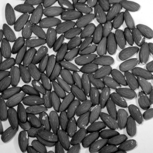
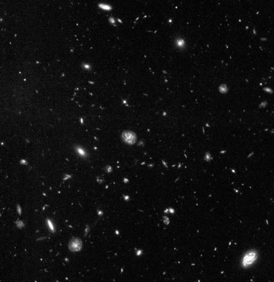
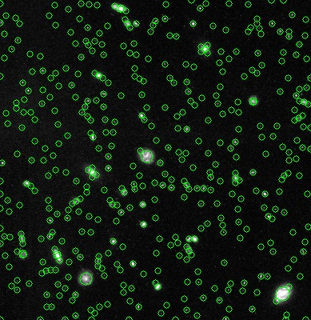

Laplacian-of-Gaussians for scale-space blob detection
=====================================================

This is a C++ implementation of the [Laplacian-of-Gaussians]() method for
blob detection. This implementation distinguishes itself from existing 
implementations, such as in scikit-image or opencv, in two aspects:
- Instead of a sampled Gaussian kernel, it uses the correct discrete analog of
the continuous Gaussian from the perspective of scale-space theory. This kernel, which I will refer to 
as the *discrete Gaussian kernel*, is based on modified Bessel functions 
(see [here](https://en.wikipedia.org/wiki/Scale_space_implementation#The_discrete_Gaussian_kernel).)

This library provides two C++ functions:
- ``discreteGaussian``: Convolves an n-dimensional array with a discrete Gaussian kernel.
- ``laplacianOfGaussians``: Performs blob detection on an image with the Laplacian-of-Gaussians method, using the 
discrete Gaussian kernel for the underlying scale-space representation.


Installation
-----

This library requires you to have OpenCV installed and linked to your project such that
```#include <opencv2/opencv.hpp>``` works. See
[here](https://docs.opencv.org/4.6.0/d7/d9f/tutorial_linux_install.html) for the Linux-installation guide
or [here](https://docs.opencv.org/4.x/d3/d52/tutorial_windows_install.html) for the Windows-installation guide.

Since this is a lightweight header-only library, you can simply copy the `include` directory
to a location where your project can find it and then use it directly with ```#include "blobs.hpp"```.

As an example, your `CMakeList.txt` could look something like this:

```cmake
cmake_minimum_required(VERSION 3.22)
project(use_blob_detection)

set(CMAKE_CXX_STANDARD 17)
find_package( OpenCV REQUIRED )
include_directories(${OpenCV_INCLUDE_DIRS})

set(BLOBDETECTION "your/path/blobs_cpp/include]")

add_executable(main main.cpp)
target_link_libraries(main ${OpenCV_LIBS})
target_include_directories(main PRIVATE ${BLOBDETECTION})
```


Usage
-----

**Example 1: gaussianFilter2d**

See also [here]() for the source file.

```c++
// First, include some stuff for file-handling.
#include <fstream>
#include <filesystem>
#include <gnuplot-iostream.h>
// We also need to include OpenCV.
#include <opencv2/opencv.hpp>
// Include blob detection.
#include "blobs.hpp"


using namespace cv;
using std::filesystem::current_path;


int main(){
    // We test the Gaussian filter on a test image of almonds.
    String testImageName = "almonds.png";
    // First, we check that the file exists.
    ifstream ifile;
    ifile.open(testImageName);
    // Next, we load the image into an OpenCV matrix.
    Mat test_image;
    test_image = imread( testImageName, IMREAD_GRAYSCALE);
    // The Gaussian filter has two parameters corresponding to the standard deviation of the Gaussian kernel in x1-
    // and x2-direction (horizontal and vertical).
    double sigma1 = 5.0;
    double sigma2 = 2.0;
    // We apply the filter by calling the `gaussianFilter2d`-function.
    Mat blurred_image = gaussianFilter2d(test_image, sigma1, sigma2);
    // Finally, we plot both images with OpenCV.
    String nameTest = "Original image";
    String nameBlurred = "Filtered image with sigma1 = " + to_string(sigma1) + " and sigma2 = "
                         + to_string(sigma2);
    namedWindow(nameTest, WINDOW_NORMAL);
    namedWindow(nameBlurred, WINDOW_NORMAL);
    imshow(nameTest, test_image);
    imshow(nameBlurred, blurred_image);
    // Press enter to close the windows.
    waitKey(0);
    destroyWindow(nameTest);
    destroyWindow(nameBlurred);
    return 0;
}
```
The output should be this:




**Example 2: LoG**

See also [here]() for the source file.

```c++
// Includes as above.
#include <cstdlib>
#include <opencv2/opencv.hpp>
#include <fstream>
#include "blobs.hpp"


using namespace cv;


int main(){
    // To test the blob detection method, we use an image of galaxies.
    String imageFile = "hubble.jpg";
    // Check that the file exists.
    ifstream ifile;
    ifile.open(imageFile);
    // Load the image into an OpenCV matrix.
    Mat testImage = imread( imageFile, IMREAD_GRAYSCALE);
    // Make the image a bit smaller to speed up the code.
    resize(testImage, testImage, Size(), 0.5, 0.5);
    testImage.convertTo(testImage, CV_32FC1);
    // Normalize for better plotting.
    normalize(testImage, testImage, 0, 1, NORM_MINMAX);
    // Next we want to apply the Laplacian-of-Gaussians method for blob detection. For this we have to set the
    // scales we want to look at.
    double sigmaMin {2};
    double sigmaMax {20};
    int numSigma {19};
    // We also have to set the threshold for blob detection and the maximum relative overlap for detected blobs.
    // Check the doc-string of the `LoG` function to find out more about those.
    double rthresh {0.02};
    double maxOverlap {0.2};
    // Now we can perform blob detection.
    tuple<BlobList, BlobList> blobs = LoG(testImage, sigmaMin, sigmaMax, numSigma, rthresh, maxOverlap);
    // The LoG method returns a tuple of two `BlobList`-objects, corresponding to the detected bright and dark blobs.
    BlobList brightBlobs = get<0>(blobs);
    BlobList darkBlobs = get<1>(blobs);
    /* For visualization of the detected blobs, we can use the 'paintBlobs' function provided by 'blobs.hpp'. Since in
     * this case we are only interested in the bright blobs, we ignore 'darkBlobs'. If we would be interested in
     * plotting both bright and dark blobs, we could call 'paintBlobs' instead with the tuple 'blobs'. */
    Mat imageWithBlobs = paintBlobs(testImage, brightBlobs);
    // The function 'paintBlobs' returns the test image with the detected blobs drawn on it.
    // Let us plot both the original image and the image with the detected blobs.
    String nameOrig = "Original image";
    String nameBlobs = "Image with blobs";
    namedWindow(nameOrig, WINDOW_NORMAL);
    namedWindow(nameBlobs, WINDOW_NORMAL);
    imshow(nameOrig, testImage);
    imshow(nameBlobs, imageWithBlobs);
    // Press Enter to close windows.
    waitKey(0);
    destroyWindow(nameOrig);
    destroyWindow(nameBlobs);
    return 0;
}
```
The output should be this:





Possible future features:
-------------------------

- Additional speedup through downsampling (pyramid).
- Implementation of further blob detection methods (difference of Gaussians, determinant of Hessians, etc.).
- Shape-adaptation: Instead of only identifying circles, detect blobs as rotated ellipses.
